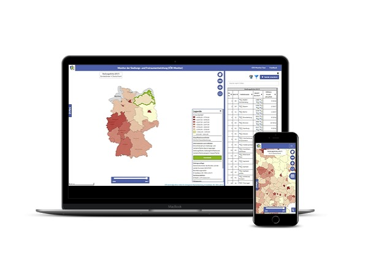
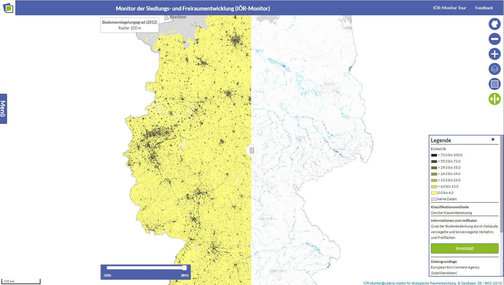
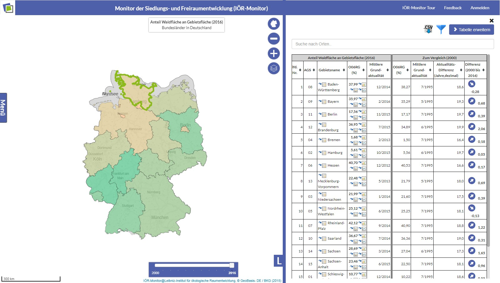
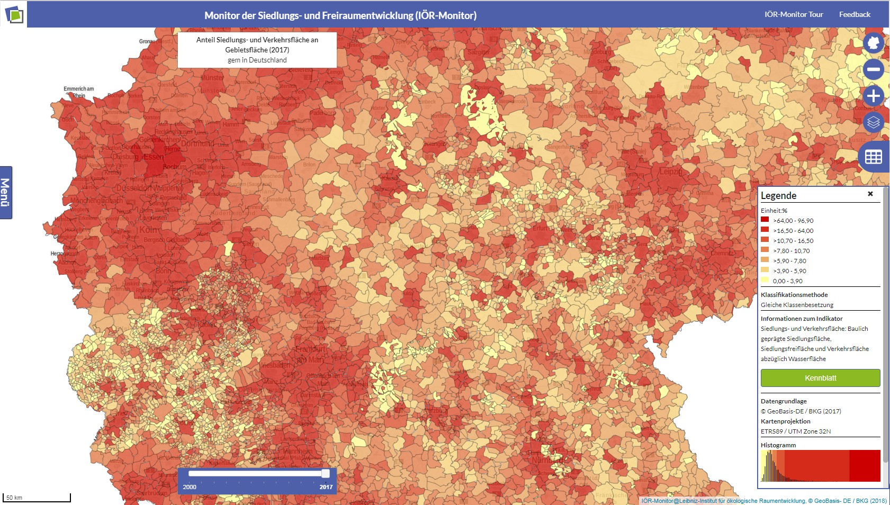

## Funktionsumfang
____
Inzwischen werden fast 80 Indikatoren der Kategorien Siedlung, Freiraum, Verkehr, Gebäude, Landschaftsqualität (z. B. „Hemerobieindex“, „Ökotondichte“), Landschafts- und Naturschutz, Ökosystemleistungen, Bevölkerung, Risiko und Relief angeboten.Für jeden Indikator wird die Berechnungsmethodik und die Bedeutung in einem Kennblatt dargestellt.

Für die Ausgabe der Indikatoren stehen folgende Optionen zur Verfügung:

+ Karten auf Basis von Vektordaten mit unterschiedlicher räumlicher Ausdehnung (Gemeinde- bis Bundesebene)
+ Karten auf Basis von Rasterdaten mit hoher räumlicher Auflösung (bis zu 100 Meter Rasterweite)
+ Tabellen und Entwicklungsgraphen zu allen Indikatoren (Export der Tabellenwerte im CSV Dateiformat)
+ Individuell gestaltete Karten mit Speicheroption und Ergebnisversand per E-Mail (Modifikation von Farbwerten und Klassenanzahl möglich)
+ Gebiets- und Zeitvergleiche sowie statistische Auswertungen
## Bedeutung
____
Der IÖR-Monitor stellt Informationen zum Zustand und zur Entwicklung des nur begrenzt verfügbaren und schutzbedürftigen Gutes Fläche bzw. Boden bereit. Sie dienen als Grundlage für Bewertungen und sind insbesondere für die Flächenhaushaltspolitik und die Raum- und Fachplanungen auf allen Ebenen (Bund, Länder, Planungsregionen, Kreise und Gemeinden) von Bedeutung. Mit dem IÖR-Monitor lassen sich zum Beispiel Größen wie die Flächenversiegelung Bevölkerungsdichte, die Verkehrsfläche pro Einwohner und die Erreichbarkeit städtischer Grünflächen anzeigen und vergleichen. Diese Informationen sind auch für Wissenschaft, Wirtschaft, interessierte private Nutzer und die Medien von Interesse und jederzeit im Internet abrufbar. Im 3. Geo-Fortschrittsbericht der Bundesregierung wird der IÖR-Monitor als „exzellentes Beispiel für Open Government“ angeführt. Weiterhin wird Deutschland in der Erhebung und dem Monitoring der Flächennutzungsstruktur auf Basis der Analyseergebnisse des Monitors als europäisch führend eingestuft. Der IÖR-Monitor konnte sich nach Auswahl durch eine Jury als eine Dienstleistung für eine verantwortungsvolle Zukunftsgestaltung auf der Woche der Umwelt (2016) einer breiten Öffentlichkeit präsentieren.

Durch das Bereitstellen von Informationen zur Siedlungs- und Verkehrsflächenentwicklung leistet der IÖR-Monitor einen Beitrag zur nationalen Nachhaltigkeitsstrategie von 2002. Die Bundesregierung hat darin das Ziel festgelegt, den Flächenverbrauch durch Siedlungs- und Verkehrsnutzungen in Deutschland bis zum Jahr 2020 auf 30 Hektar täglich (30-Hektar-Ziel) zu reduzieren. Um die Erreichung dieses Zieles zu evaluieren ist ein genaues und aktuelles Flächenmonitoring notwendig.
## Screenshots
____

